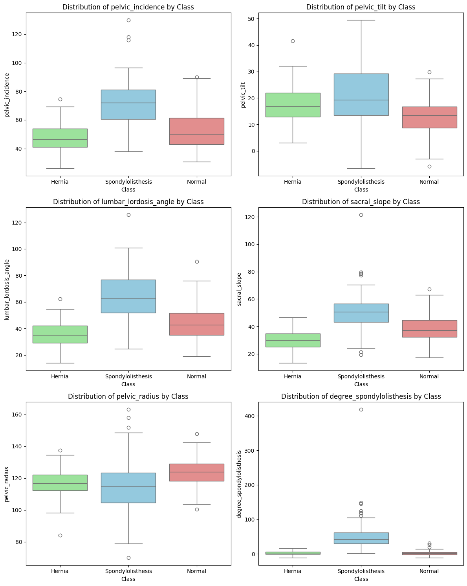
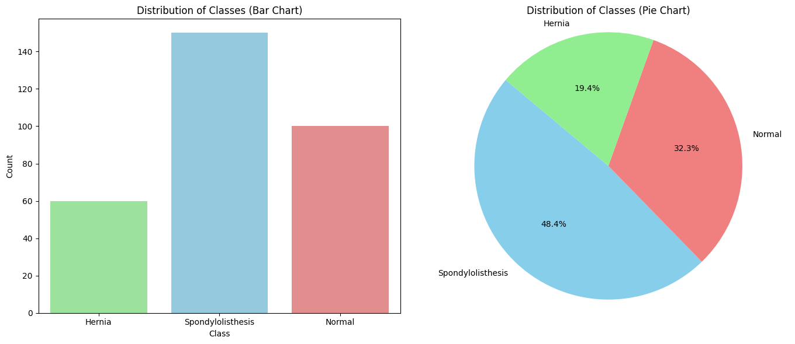
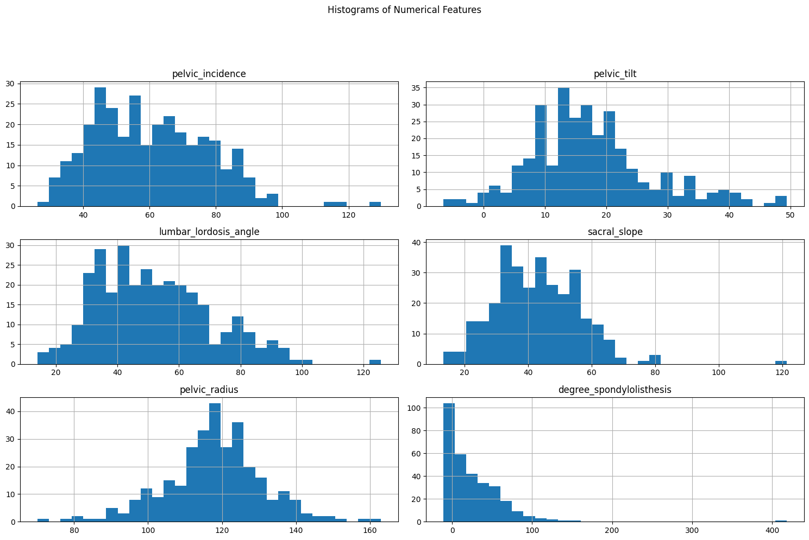

# 📄 SpineScope – Project Report - 🟢 **Beginner Track**

Welcome to your personal project report!  
Use this file to answer the key reflection questions for each phase of the project. This report is designed to help you think like a data scientist, guide AI tools more effectively, and prepare for real-world job interviews.

---

## ✅ Phase 1: Setup & Exploratory Data Analysis (EDA)

> Answer the EDA questions provided in the project materials here. Focus on data quality, trends, anomalies, and relationships.

### 🔑 Question 1: Which features are most strongly correlated with spinal abnormalities?

### 🔑 Question 2: Are any features linearly dependent on others (e.g., sacral slope and pelvic incidence)?

### 🔑 Question 3: Do biomechanical measurements cluster differently for normal vs. abnormal cases?

### 🔑 Question 4: Are there multicollinearity issues that impact modeling?

---

## ✅ Phase 2: Model Development

> This phase spans 3 weeks. Answer each set of questions weekly as you build, train, evaluate, and improve your models.

---

### 🔍 Week 1: Feature Engineering & Data Preprocessing

#### 🔑 Question 1:
**Which biomechanical features show the strongest relationship with the target (spinal condition), and how did you determine this?**

💡 **Hint:**  
Use `.groupby(target).mean()`, `.corr()`, and plots like `boxplot` or `violinplot` to inspect feature separation by class.  
Consider using statistical tests (e.g., ANOVA or t-tests) to validate separation.
*
based on the boxplot degree_spondylolisthesis and sacral_slope  have  the strongest relationship with the target, and this was also supported by the ANOVA test where we got p-value of 0. and according to the ANOVA TEST any p-value less than 0.05 is considered to have a strong relationship with the target.

*
---

#### 🔑 Question 2:
**Before building any model, what patterns or class imbalances did you observe in the target variable? Will this affect your modeling choices?**  

💡 **Hint:**  
Use `.value_counts()` or bar plots on the target column.  
If one class dominates, consider techniques like class weights or stratified sampling.

*
As the screenshot shows, the dataset is highly imbalanced, with the majority of the data labeled as abnormal. This means a model could achieve high accuracy simply by predicting the majority class most of the time.

*

---

#### 🔑 Question 3:
**Which features appear skewed or contain outliers, and what transformations (if any) did you apply to address them?**  

💡 **Hint:**  
Use `.hist()`, `df.skew()`, or boxplots.  

Try log-transform or standardize features if skewed.  
Consider z-score or IQR for outlier detection.

*
the histogram graph shows that degree_spondylolisthesis has a very high skewness value (4.318), indicating a strongly right-skewed distribution.
pelvic_incidence, pelvic_tilt, lumbar_lordosis_angle, and sacral_slope show moderate positive skewness (values between 0.5 and 0.8), suggesting their distributions are also skewed to the right

The Z-score shows that degree_spondylolisthesis and sacral_slope have high values (above 3), indicating the presence of outliers. This observation is also confirmed by the boxplot.

since degree_spondylolisthesis was has the most skewed data distripution we have applied log1p to correct the skewness, resulting in a less skewed distibution

*

---

#### 🔑 Question 4:
**What scaling method did you apply to your numerical features, and why was it necessary (or not) for the algorithms you plan to use?**  

💡 **Hint:**  
Logistic regression and distance-based models require scaling.  
Tree-based models do not.  
Use `StandardScaler` or `MinMaxScaler` as needed. Justify your choice.

✏️ *Your answer here...*

---

#### 🔑 Question 5:
**Did you create any new features that might help distinguish between different spinal conditions? If yes, what are they and what was the reasoning behind them?**  

💡 **Hint:**  
Try feature ratios or differences, like `pelvic_incidence - pelvic_tilt`.  
Use domain insight or trial-and-error to create potentially useful features.

✏️ *Your answer here...*

---

---

### 📆 Week 2: Model Development & Experimentation

### 🔑 Question 1:

### 🔑 Question 2:

### 🔑 Question 3:

### 🔑 Question 4:

### 🔑 Question 5:

---

### 📆 Week 3: Model Tuning

### 🔑 Question 1:

### 🔑 Question 2:

### 🔑 Question 3:

### 🔑 Question 4:

### 🔑 Question 5:

---

## ✅ Phase 3: Model Deployment

> Document your approach to building and deploying the Streamlit app, including design decisions, deployment steps, and challenges.

### 🔑 Question 1:

### 🔑 Question 2:

### 🔑 Question 3:

### 🔑 Question 4:

### 🔑 Question 5:

---

## ✨ Final Reflections

> What did you learn from this project? What would you do differently next time? What did AI tools help you with the most?

✏️ *Your final thoughts here...*

---
